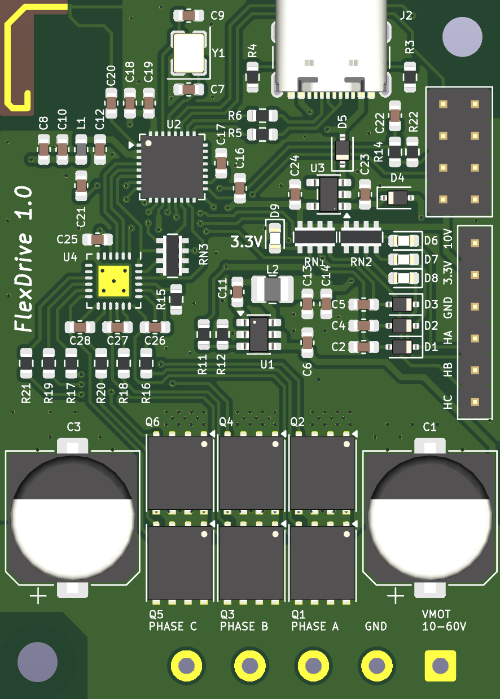

# FlexDrive

Simple, low-cost, yet powerful BLDC motor controller.

## Specs and Features
- Dimensions: 40x56 mm
- Motor voltage: 10...60 V
- Peak current: 60 A (based on MOSFET specs). 20 A continous should be realistic depending on cooling
- 12 € component cost (based on 1x part prices). High volume discount could easily reduce to < 8 € per board
- Hall as default sensor input. 2 GPIOs (default UART Rx/Tx) available for other sensors
- 2-layer design for easy mods/repair (4-layer require long pre-heating to de-solder components)
- ESP32-C3 microcontroller with PCB antenna
- [SimpleFOC](https://simplefoc.com) based firmware
- Flexible control interface (therefore the name):
    - USB serial with 115200 baud using the normal SimpleFOC commands: https://docs.simplefoc.com/commander_motor
    - Analog / direction
    - RC PWM (1...2 ms pulses)
    - (Not implemented yet) wireless via ESP-Now
    - (Not implemented yet) chaining of multiple boards via UART

NOTE:
- **No current sensing** (to keep it simple and cheap). Voltage torque, velocity, angle, open and closed loop modes working though
- The GPIO pins are not 5 V tolerant! Use max 3.3 V for analog, direction / RC PWM. The hall sensor inputs can be high voltage as protected via diodes.
- 3.3 V and 10 V generated on the board are output and can be used to power the hall sensors of the motor

## Flashing the firmware
You need VSCode with the PlatformIO IDE extension installed. When the firmware directory is opened with VSCode, the extension detects the [platformio.ini](firmware/platformio.ini) and sets up everything automatically (downloads dependencies like the Arduino framework and SimpleFOC library).

NOTE: As of writing this (Sep 2026), there is an [issue](https://github.com/simplefoc/Arduino-FOC/issues/471) in the SimpleFOC library (V2.4.0) which still persists. So you have to fix it locally:
- Open *.pio/libdeps/esp32-c3-devkitm-1/Simple FOC/src/drivers/hardware_specific/esp32/esp32_ledc_mcu.cpp*
- Move `group_channels_used[group]++;` after `params->groups[...;` in the `_configure<n>PWM` functions

Connect the board with a USB-C cable to the computer and click on the upload arrow (on the bottom blue bar) in VSCode.

NOTE: The microcontroller stays in bootloader mode when only powered by USB. You need to disconnect the USB cable and first power the board with motor voltage to boot the firmware application.